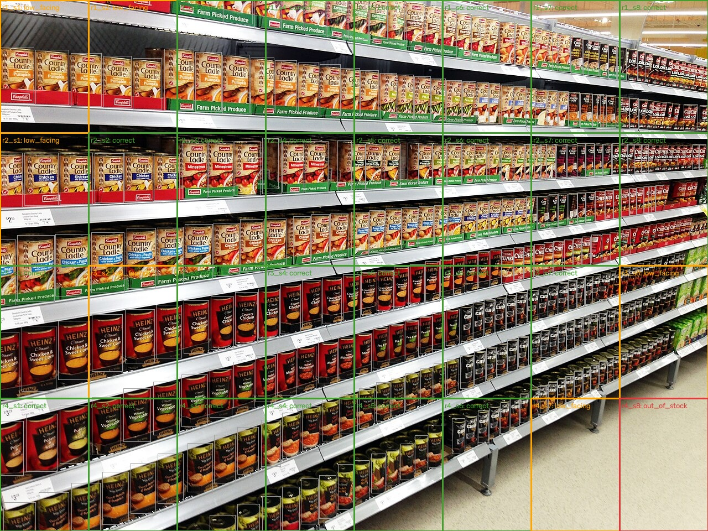

# Shelf Planogram Compliance Agent



*A multi-agent computer vision system that inspects retail shelf photos, compares them against a planogram, and generates restocking work orders — with a full audit trail.*

## Author

Lakwan Bonsu – ITAI 1378, Summer 2026

## Project Tier

**Tier 3** — Three agents with distinct roles (Scanner / Analyst / Task) communicate through a defined message envelope; a central orchestrator routes and logs every hand-off to JSONL traces.

## Problem & Solution

### The Problem

Retail stores lose sales when shelf layouts drift from the planogram (the map of what should be where): products go out of stock, run low on facings, or end up in the wrong spot, and manual audits are slow and inconsistent.

### The Agent

Point it at a folder of shelf photos. It validates each image (Stage 1–2), detects every product with a SKU-110K-trained YOLO11 model (Stage 3), compares detections against a planogram with inspectable rules (Stage 4), and produces an annotated image + machine-readable restocking work order (Stage 5) — logging every agent hand-off to a trace file (Stage 6).

### Impact

Store staff get a prioritized to-do list ("slot r4_s8 is empty") with photo evidence, in seconds per photo, instead of walking aisles with paper.

## Agent Architecture

See [docs/architecture.md](docs/architecture.md) for the full diagram and message contract.

- **Agent framework:** custom Python loop (deliberately no LLM in the baseline — rules first)
- **CV model:** YOLO11n trained on SKU-110K ([weights link](models/README.md)) — detects product *locations* (~300 per dense shelf photo)
- **Reasoning:** rule-based planogram slot alignment → `correct` / `low_facing` / `out_of_stock` / `misplaced`
- **Communication:** `Envelope{run_id, sender, recipient, message_type, timestamp, confidence, payload}` logged per hand-off

## Dataset / Test Inputs

- `data/sample/` — 6 shelf photos (SKU-110K figures + Wikimedia Commons); sources in [data/README.md](data/README.md)
- `data/planogram.json` — default 4×8 planogram, row bands as fractions of image height
- SKU-110K (CVPR 2019) is the underlying detection dataset; the 20-scenario test manifest lives in `notebooks/02_evaluation.ipynb`

## How to Run

### Installation

```bash
git clone https://github.com/blakwan-crypto/shelf-planogram-agent.git
cd shelf-planogram-agent
python3 -m venv .venv && source .venv/bin/activate
pip install -r requirements.txt
# download model weights (one command, see models/README.md):
curl -L -o models/sku110k-yolo11-n640.pt \
  https://huggingface.co/chistopat/sku110k-yolo11-object-detector/resolve/main/weights/sku110k-yolo11-n640.pt
cp .env.example .env   # optional; baseline needs no API keys
```

### Quick Start

```bash
python -m agents.orchestrator --images data/sample
```

Outputs: `results/images/` (annotated), `results/tasks/` (work orders + reports), `results/traces/` (JSONL trace), `results/metrics.json`.

## Demo Video

[Watch or download the 1m38s explainer](videos/shelf-planogram-agent-demo/renders/shelf-planogram-agent-demo.mp4) — a narrated walkthrough of the problem, agent pipeline, evaluation results, and honest limitations.

## Evaluation & Results

Full write-up: [results/eval_report.md](results/eval_report.md) (component + system level, all 25 agent flags human-verified against photos).

- **Component level:** detector published test metrics on SKU-110K — precision 0.896, recall 0.838, mAP@0.5 0.906; our measured detections/image: 7–909 depending on shelf density (see report for the `max_det` truncation bug we found and fixed)
- **System level:** 11/11 robustness scenarios pass with 0 crashes (`tests/run_scenarios.py`); 6/6 sample images complete; 0.6–1.7 s/image on Apple Silicon; every hand-off traced
- **Failure cases (honest):** under-detection on unusual packaging (shelf4: 14 boxes on a full shelf) and color-cast photos (shelf6: 7 boxes); false `low_facing` flags from perspective foreshortening; no true-positive OOS measurement yet (needs real staged photos — synthetic blackout test showed correct-direction sensitivity)

## Example Agent Run

One real image (`data/sample/shelf3.jpg`) through the pipeline — each line is one envelope from `results/traces/run_20260802-082956-475c.jsonl`:

```
Orchestrator  -> ScannerAgent  | PreprocessResult — valid image 1280x960
ScannerAgent  -> AnalystAgent  | ShelfScan — 298 products, mean conf 0.5789
AnalystAgent  -> TaskAgent     | ComplianceReport — {correct: 25, low_facing: 6, out_of_stock: 1, misplaced: 0}
TaskAgent     -> Orchestrator  | WorkOrder — 7 tasks (restock/fill/investigate)
```

Reading it: the image passed validation (Stage 2), the detector found 298 products (Stage 3), the Analyst compared them against the 4×8 planogram and found 6 low slots + 1 empty slot (Stage 4), and the TaskAgent wrote 7 actionable tasks plus the annotated image (Stage 5) — all logged (Stage 6).

## Key Learnings

- Off-the-shelf YOLOv8 (COCO classes) detects **nothing** on dense shelf photos — a domain-trained model is mandatory (proven in our feasibility test)
- SKU-110K models find *where* products are, not *what brand* — this defined the honest project scope
- Traces double as debugging tools and as evidence the agent actually works

## Future Improvements

- Brand-level identification (embedding matcher against a product catalog) → true "misplaced product" detection
- OCR of shelf-edge labels as a second CV tool (Stage 3 enrichment)
- Per-shelf planogram auto-calibration to handle camera tilt
- Optional LLM controller to choose tools (Tier 2-style tool-calling on top of Tier 3)

## References

- Goldman et al., CVPR 2019 — SKU-110K dense retail detection dataset
- chistopat/sku110k-yolo11-object-detector (Hugging Face) — detector weights
- Ultralytics YOLO11

## License

MIT
